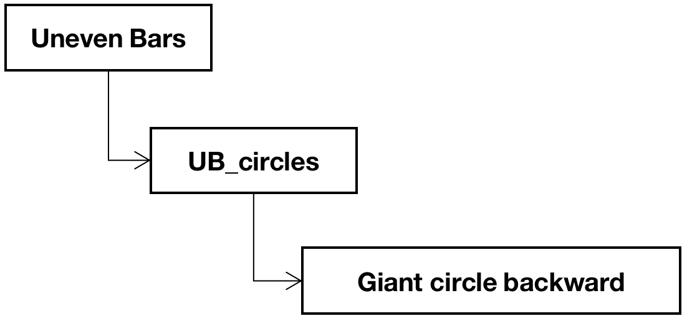
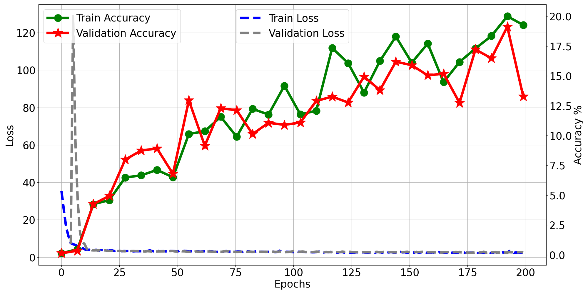

# Learning the Predictability of the Future with Regularization 🦾


## Introduction ###
In this project, we attempt to realize the ideas and reproduce the results from Didac Suris, Ruoshi Liu, Carl Vondrick’ work in [Learning the Predictability of the Future](https://hyperfuture.cs.columbia.edu/) that was published in 2021 at arXiv.org. The goal of our project is implementing deep learning neural networks that can recognize what is taking place in a video and make predictions for the future hierarchically based on the ​​Dense Predictive Coding(DPC) and in the Hyperbolic Space. Regarding the fact that the datasets mentioned in the original paper including FineGym, Hollywood2, Kinetics- 600 and MovieNet are extremely large,  time-consuming  to download and process, in this paper we focus on the performance of the proposed model on FineGym dataset. Experimental with hyperbolic loss results show that the train…… On the other hand, the test accuracy over 288 classes reaches 11.45% compared with 13.37%  from the original paper, whereas the top-down hier-accuracy and bottom-up hier-accuracy are 67.94% and 41.03% respectively.<br>
**Our Report:**[]()

**Main Contributions**
- [x] Reproduce the original paper's results
- [x] Introduce a new regularization idea in loss function
- [x] Collect and compare the resutls with original paper (In Hyperbolic space and Euclidean space)<br>


**Our Results**
| Method Name | Accuracy | Top-Down | Bottom-Up |
|--------|------------------------|------|---------|
| Hyperbolic(ours) | - | - | - |
| Hyperbolic(original) | - | - | - |
| Euclidean(ours) | - | - | - |
| Euclidean(original) | - | - | - |
| Random | - | - | - |

**Sample Result Visualization**
<div align=center>


</div>

                             Input Sample                                          Inference Label

## Main File/Folder Description
| File/Folder Name    | Description |
|--------|------------------------|
| `./backbone` | backbone model folder (resnet) |
| `./checkpoints`   | Our trained Hyperbolic space weights and Euclidean space weights |
| `./Euclidean_train/Hyperbolic_train` | Training results (tensorboard log files) |
| `download_script.py` | Dataset download script |
| `split_script.py` | Clip videos to small clips |
| `label_num2str.py` | Transfer inference from numbers to strings |
| `main.py` | Main script |
| `models.py` | All models included |
| `datasets.py` | Datasets read file |
| `trainer.py` | Training loop |
| `plot_utils.py` | Results plot file |
| `xx.sh` | All shell files indicate how to use main.py (functions as their names)|


## How to Use

### Known Good Platforms
| OS     | Versions |
|--------|----------|
| Ubuntu | 18.04    |

### Initialization
We are using python3.8 to match the certain version of pytorch. If you do not have, please run:
```
sudo apt-get install python3.8 python3.8-venv python3.8-dev
```
```
git clone https://github.com/ecbme6040/e6691-2022spring-project-yyhh-yj2677-hl3515.git
cd E6691-2022spring-project-yyhh-yj2677-hl3515
python3.8 -m venv venv 
source venv/bin/activate
pip install -r requirements
```

### Download Dataset
There are two ways to download dataset that we used:<br>
* (1) Directly use our dataset_info link (Sample video clips): [Dataset Info in Google Drive](https://drive.google.com/drive/folders/13sGzOKGJ5RIgMhB9dhMBeayrS8OOC9Ll?usp=sharing). If you take (1) directly jump to **train & test** part.
* (2) If you want to get full dataset, first download video annotations: [From Original Author](https://hyperfuture.cs.columbia.edu/dataset_info.tar.gz). You will have to set the path to that folder in --path_data_info in all .sh files. As a reminder, you can extract the content from a .tar.gz file by using tar -xzvf archive.tar.gz. Then run:
```
python download_script.py 
```
All video files would be downloaded in **videos** folder.

### Clip Videos to Sequence 
The specific structure we use is same as original author:
`FineGym`:

* `annotations`: directory with all the files under the v1.1 section in the given link.<br>
* `categories`: directory with all the files under the "Categories" section in the given link.<br>
* `event_videos`: videos already split by event, with ID of the form {YouTubeID}_E_{start_event:06d}_{end_event:06d}.mp4<br>
* `action_videos`: event videos split by action, with ID of the form {YouTubeID}_E_{start_event:06d}_{end_event:06d}_A_{start_action:06d}_{end_action:06d}.mp4<br>
* `stage_videos`: action videos split by stage of the action, with ID of the form {YouTubeID}_E_{start_event:06d}_{end_event:06d}_A_{start_action:06d}_{end_action:06d}_{stage_ID}.mp4<br>

After Download you need to first resize the videos to 456*256. We ffmpeg cuda version, which requires to compile manually. You could refer to: https://www.cyberciti.biz/faq/how-to-install-ffmpeg-with-nvidia-gpu-acceleration-on-linux/
```
for file in videos/*/*.mp4
do
    if ! grep -q _reduced <<< "$file"; then
        ffmpeg -hwaccel cuda -n -i "$file" -vf "scale=max(256\,2*round((256*iw/ih)/2)):-2" -c:a copy "${file%.*}_reduced.mp4"
    fi
done
```
Then change target you want to clip in split_script.py: to_extract = 'event' or 'segment' or 'stage'
```
python split_script.py
```
All clips would be clipped into dataset_info finegym folder

### Train & Test
For training:
* Hyperbolic space
```
sh train_finegym_hyperbolic.sh
```
* Euclidean space
```
sh train_finegym_euclidean.sh
```

For test, you need to specify the checkpoint path in `--pretrain` of all `.sh` files. Since Euclidean checkpoints are large than 100MB, you could download from our [Shared Link](https://drive.google.com/file/d/1lobyN_xDAnYPEva86JqojQ4diJf8KyQX/view?usp=sharing). After specify, run:
* Hyperbolic space
```
sh test_future_sub_action_linear_finegym_hyperbolic.sh
```
* Euclidean space
```
sh test_future_sub_action_linear_finegym_euclidean.sh
```

### Results Collection & Visualization
After train or test, a **logs** folder would be created and each subfolder is train/test results. Put ./img path into the plot_utils.py dpath to show your train results. We here directly use ./Hyperbolic_train as an example:
```
python plot_utils.py
```
<div align=center>

</div>
